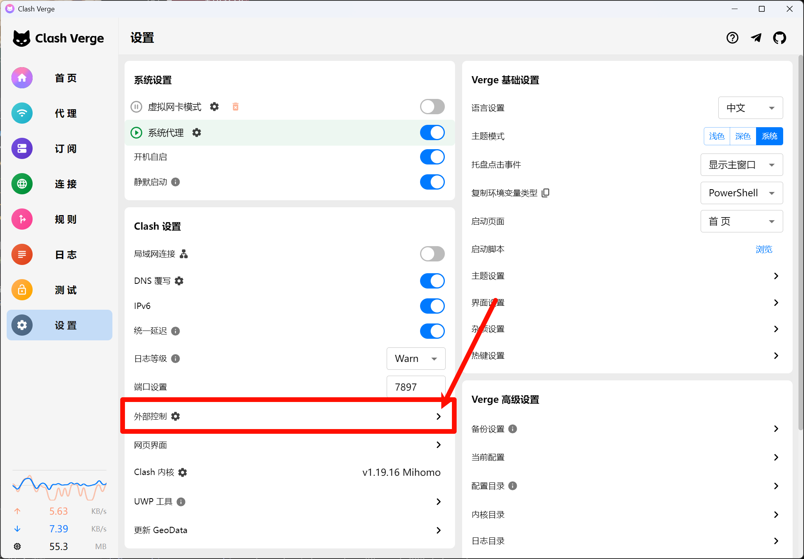
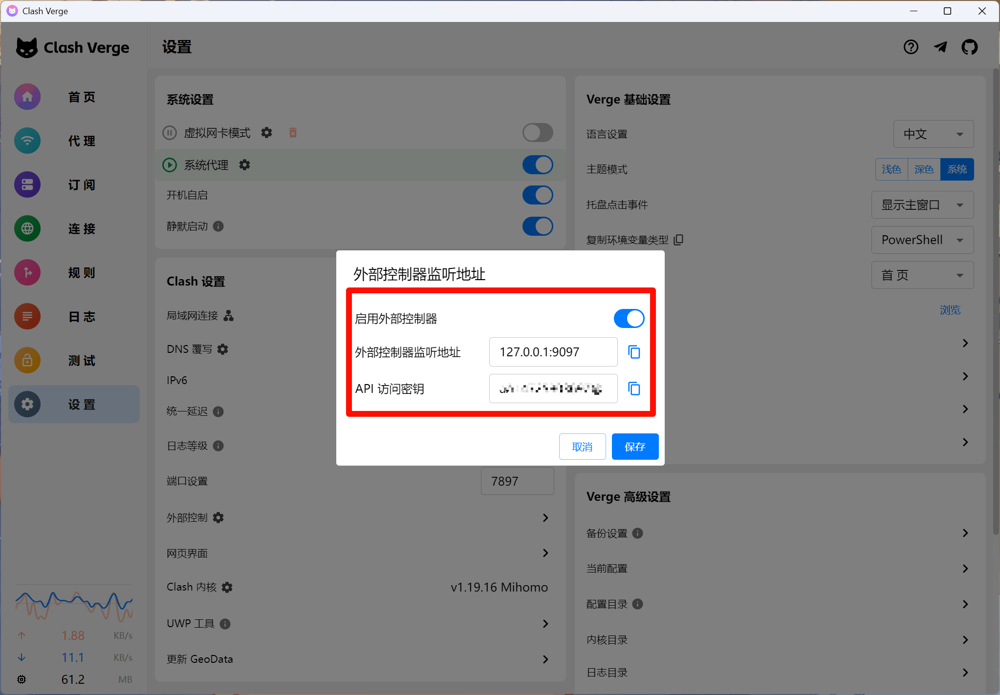

# MegaLLM 自动注册工具

自动化注册 MegaLLM 账号的 Python 脚本，支持代理池管理、并发注册、邀请码池等功能。
第一次都会4xx或者5xx失败，耐心等待下一次请求即可！！！！
## 功能特性

- ✅ **临时邮箱**: 自动获取临时邮箱地址
- ✅ **自动注册**: 自动完成账号注册流程
- ✅ **邮箱验证**: 自动轮询邮箱获取验证码并完成验证
- ✅ **浏览器自动验证**: 自动绕过 Vercel Security Checkpoint
  - 使用 Playwright 模拟真实浏览器
  - 自动完成安全验证挑战
  - Cookies 缓存和复用机制
  - 支持无头模式和可视化模式
- ✅ **代理池管理**: 基于 Clash API 的智能代理池
  - 自动从 Clash API 获取代理节点列表
  - 并发健康检查，快速过滤不可用节点
  - 自动故障转移，失败节点自动剔除
  - 代理状态持久化存储
- ✅ **并发注册**: 支持多任务并发执行，提高效率
- ✅ **邀请码池**: 可选的邀请码池功能
  - 自动收集新注册账号的邀请码
  - 随机选择邀请码进行注册
  - 邀请码持久化存储
- ✅ **重试机制**: 注册失败自动重试
- ✅ **数据导出**: 自动保存账号信息到 CSV 文件



## 环境要求

- Python 3.7+
- Clash 代理客户端 (如 Clash Verge)
- 依赖库:
  - requests
  - playwright

## 安装

1. 克隆仓库
```bash
git clone https://github.com/3351163616/MegaLLM_toy
cd MegaLLM_toy
```

2. 安装依赖
```bash
pip install -r requirements.txt
```

3. 安装 Playwright 浏览器
```bash
playwright install chromium
```

或使用 uv:
```bash
uv sync
playwright install chromium
```

4. 配置 Clash
   - 确保 Clash 已启动
   - 开启 Clash API (External Controller)
   - 记录 API 地址和密钥

## 配置说明

编辑 `config.json` 文件:

```json
{
  "email_base": "https://mail.chatgpt.org.uk",
  "referral_code": "",
  "api_base": "https://megallm.io",

  "account": {
    "password": "your-password"
  },

  "clash": {
    "api_url": "http://127.0.0.1:9097",
    "secret": "your-clash-secret",
    "local_proxy": "http://127.0.0.1:7897"
  },

  "proxy_pool": {
    "health_check_interval": 300,
    "max_failures": 3,
    "concurrent_tasks": 5,
    "test_url": "http://www.gstatic.com/generate_204"
  },

  "referral_pool": {
    "enabled": true,
    "initial_codes": []
  },

  "retry": {
    "max_retries": 5,
    "retry_delay": 30
  },

  "email_polling": {
    "timeout": 600,
    "interval": 5
  },

  "browser": {
    "enabled": true,
    "headless": true,
    "timeout": 30000
  }
}
```

### 配置项详解

#### 基础配置
- `email_base`: 临时邮箱 API 地址
- `referral_code`: 固定邀请码 (邀请码池禁用时使用)
- `api_base`: MegaLLM API 地址

#### 账号配置
- `password`: 注册账号使用的固定密码

#### Clash 配置
- `api_url`: Clash External Controller 地址
- `secret`: Clash API 密钥 (在 Clash 配置中查看)
- `local_proxy`: Clash 本地代理端口

#### 代理池配置
- `health_check_interval`: 定时健康检查的间隔时间 (秒)
- `max_failures`: 节点失败多少次后被剔除
- `concurrent_tasks`: 同时运行的注册任务数量
- `test_url`: 用于测试代理连通性的 URL

#### 邀请码池配置
- `enabled`: `true` 启用邀请码池 / `false` 使用固定邀请码
- `initial_codes`: 初始邀请码列表

#### 重试配置
- `max_retries`: 注册失败最大重试次数
- `retry_delay`: 重试间隔时间 (秒)

#### 邮件轮询配置
- `timeout`: 邮件轮询超时时间 (秒)
- `interval`: 轮询间隔 (秒)

#### 浏览器配置 (新增)
- `enabled`: `true` 启用浏览器验证 / `false` 禁用
- `headless`: `true` 无头模式 / `false` 显示浏览器窗口 (调试时推荐设为 false)
- `timeout`: 浏览器操作超时时间 (毫秒)

## 使用方法

```bash
python main.py
```

或使用 uv:
```bash
uv run main.py
```

程序启动后会:
1. 加载配置
2. 初始化代理池
3. 执行启动前健康检查
4. 开始并发注册任务

## 输出文件

- `accounts.csv`: 注册成功的账号信息 (邮箱、密码、API Key)
- `referral_pool.json`: 邀请码池数据 (启用邀请码池时)
- `proxy_pool_state.json`: 代理池状态数据
- `browser_cookies.json`: 浏览器验证 cookies 缓存

## 浏览器验证说明

本工具集成了 Playwright 自动化浏览器，可以自动绕过 Vercel Security Checkpoint：

### 工作原理
1. 首次运行或 cookies 过期时，自动启动浏览器
2. 通过代理访问目标网站，完成 JavaScript 挑战验证
3. 验证通过后提取 cookies 并缓存到本地
4. 后续请求直接使用缓存的 cookies，无需重复验证
5. cookies 默认有效期 30 分钟，过期后自动重新获取

### 调试建议
- 如遇验证问题，可设置 `browser.headless: false` 查看浏览器实际操作
- 验证失败时会自动清除缓存并重试
- 可通过 `browser_handler.py` 单独测试验证功能

### 测试浏览器验证
```bash
python browser_handler.py
```

<div align="center">

**如果这个项目对你有帮助，请给个 ⭐ Star 支持一下！**
